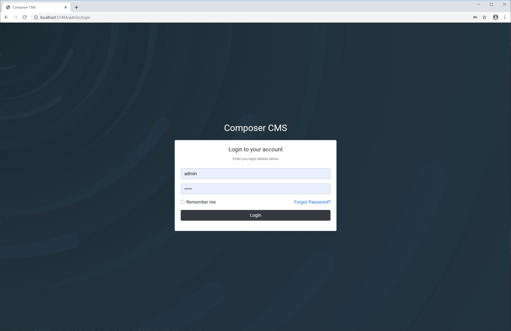
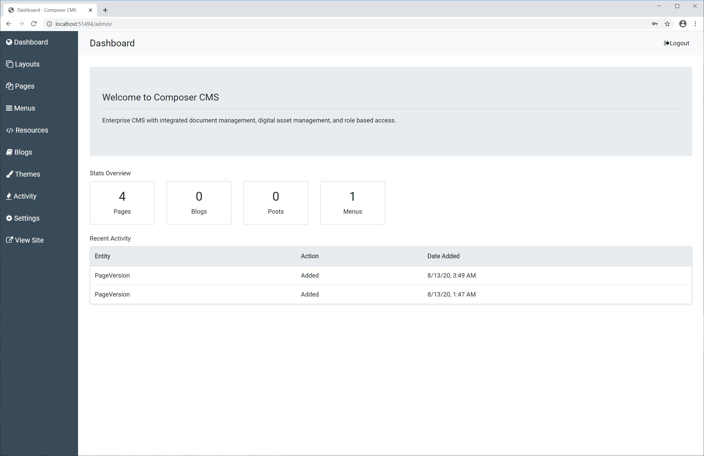
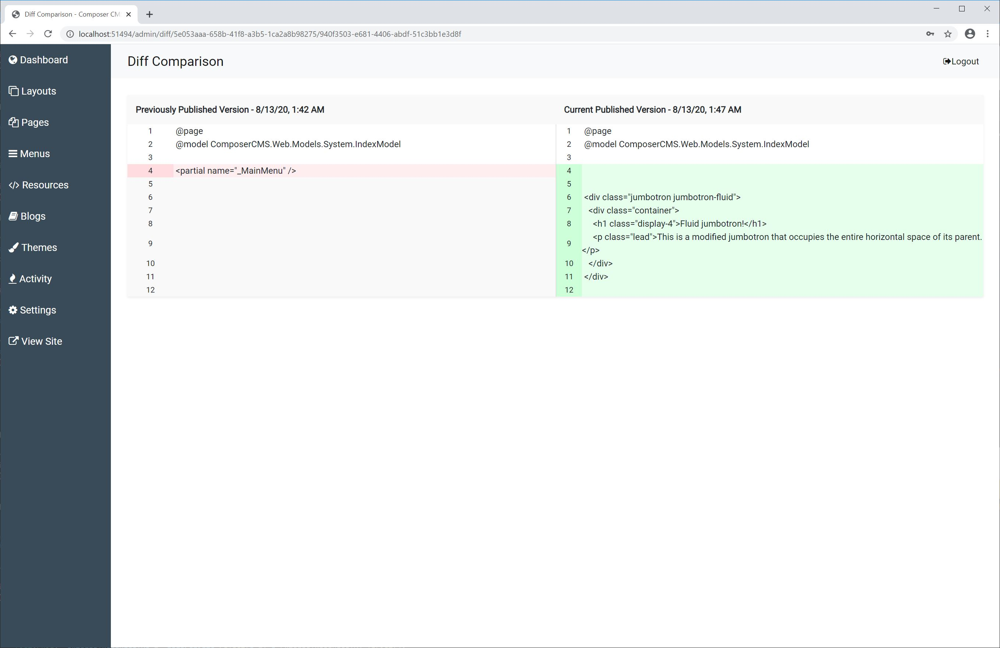

# Composer CMS

A C# based CMS system

Feature Goals
- [ ] Routing
- [ ] Blog system
- [ ] Role based authorization
- [ ] User authentication
- [ ] Analytics
- [ ] Robust publishing tools
- [x] Themes
- [ ] Built-in page and theme editor

## Preview Images

